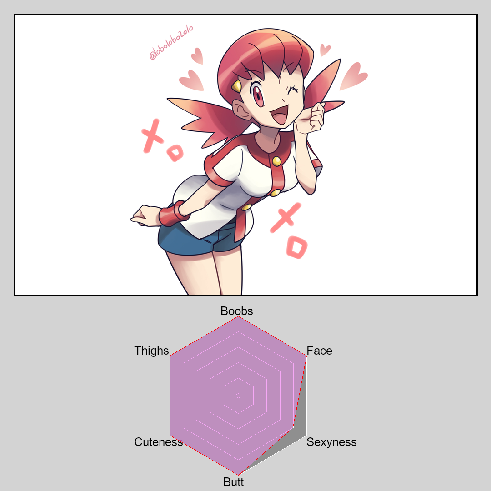

#PokeGal RadarChart Maker

## How to use
 
1. clone this run this rep
2. edit the `Pokegirl.csv` file
3. Run the `main.py` python script

Also  when selecting images to use make the images are atleast are around 1050x650 or larger. Aspect Ratio dosn't matter. 

## What you get

